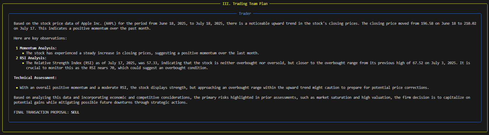

## Datalynn TradingAgent

The stock market requires constant supervision and key decision making, in Datalynn, we aim to help our clients by providing a curated trading agent utilizing our own algorithms to achieve the most out of your investment

The base of our framework follows a skeleton code that acts as an trading agent. Utilizing LLM powered agents and real time online external resources, the platform collaboratively evaluates the market conditions and informs the agents within the framework with the necessary data to generate an investment report.

Below is the general work flow on how the agent works at its base

  

The pipeline works as multiple teams, making an initial analysis of your choosing, then the research team evaluates the chosen company, the trading team then gives an initial decision which then gets sent to the management team for advisement 

Here, we dive specifically into the Trader role. In this agent, it takes in reports generated by the previous teams as past memory, and carries out an analysis on whether the specific stock chosen is to be sold, bought, or held. As an example, below is an trading plan report asking the agent to calculate the momentum and RSI in a months period, in particular, Apple.

  

The agent itself is flexible as well, in here, we are able to incorporate whichever strategy we would like the agent to carry out, momentum is just one of the many strategies that we could incorporate into this framework.

Further goals:
- Standarize the pipeline, ensuring the reports are uniform in structure and actively training the agents to do so
- Incorporate different strategies and modularize the trader agent
- Further engineer the analysts and manager agents to give key data points and actionable insights